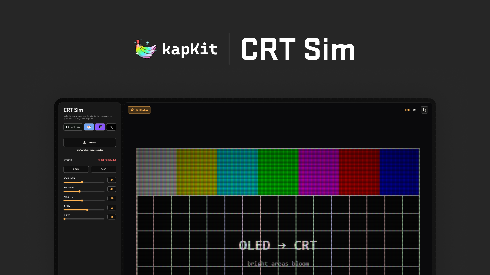

<!-- Header image goes here — drop your file at assets/header.png -->

# CRT Sim

Give any clip that old-TV look — curvature, scanlines, phosphor glow and bloom —  
then crop, trim and export it to MP4, MOV or GIF. All in your browser.

 

 

**[How-To Guide](#how-to-guide)** · **[Report a Bug](https://github.com/sidkapahi/crt-sim/issues)**

---

## Overview

CRT Simulator is a browser-based playground for the retro CRT look. Load
a clip, tune the effects live, frame it with crop and trim, and export a finished file — MP4, MOV or GIF.

Everything runs on your own machine. **No files are uploaded anywhere, no
account, nothing to install.**

**What you get:**

- **Five live effects** — curvature, scanlines, phosphor mask, vignette and bloom
- **Your own footage** — import `.mp4`, `.webm` or `.mov`, or use the test pattern
- **Aspect ratios** — switch between 4:3 and 16:9
- **Crop** — an interactive crop box locked to the chosen aspect
- **Trim** — pick an in/out range; the export covers just that range
- **Audio** — preview with mute/volume; sound is mixed into MP4/MOV exports
- **Presets** — save and load your effect settings as JSON
- **Export** — MP4, MOV (H.264, with VP9/AV1 fallback) or GIF (silent)

> [!NOTE]
> **Built with [Claude Code](https://claude.com/claude-code), fully client-side
> and open source.** It works, but the code hasn't been professionally audited —
> use at your own risk, and [PRs and fixes](https://github.com/sidkapahi/crt-sim/pulls)
> are always welcome.

## How-To Guide

### 1. Load a clip

Click **Upload** and pick an `.mp4`, `.webm` or `.mov` — or leave the built-in
**test pattern** on to dial things in first. Use the **4:3 / 16:9** toggle to
match your source.

### 2. Tune the look

Toggle each effect on or off and drag its slider (or type a number, 0–100):

- **Curvature** — barrel distortion of the screen surface
- **Scanlines** — horizontal beam lines
- **Phosphor** — RGB shadow-mask / aperture-grille pattern
- **Vignette** — darkened corners
- **Bloom** — glow bleeding out of bright areas

Hit **Reset** to return the effects to their defaults. Happy with a look? Use
**Save** to store it as a preset, and **Load** to bring it back later.

### 3. Frame it

- **Crop** — drag the crop box to reframe; it stays locked to your aspect ratio
- **Trim** — set the in/out points so the export covers only the part you want
- **Audio** — mute or set the preview volume from the media bar

### 4. Export

Pick a format chip and export:

- **MP4** / **MOV** — H.264 with audio (falls back to VP9/AV1 where needed)
- **GIF** — silent, great for embeds

The export covers your trimmed range only, and the file downloads straight to
your machine.

## Browser support

- **Chrome / Edge** — best experience; full H.264 MP4/MOV export.
- **Firefox / Safari** — the live preview works; MP4/MOV export depends on
  WebCodecs support and falls back to VP9/AV1 or WebM where needed.
- Requires WebGL. GIF export requires Web Workers.

## For Developers

The render pipeline, shaders, export internals, code map, and guides for adding
effects or export formats live in **[docs/DEVELOPMENT.md](docs/DEVELOPMENT.md)**.
The analytics event reference is in **[docs/ANALYTICS.md](docs/ANALYTICS.md)**.

There's no bundler, transpiler, or framework — it's vanilla JS + WebGL in a
single `index.html`, with all styling in `styles.css`. Edit, serve, refresh.

## License

[MIT](LICENSE) © 2026 Sid
